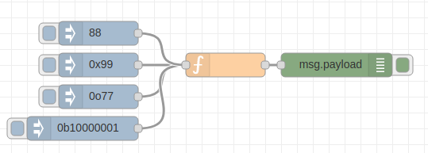
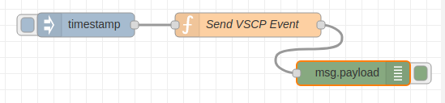

# node-vscp


Utility and constant package for VSCP programming with node.js

If you are new to VSCP you can find more info [here](https://www.vscp.org).


## Install
Install with

```bash
npm install node-vscp
```

optionally with '--save' to save dependency in the package.json file.

## Usage

Reference the module in the beginning of your file like this

```javascript
const vscp = require("node-vscp");
```

if you want to work with constants instead of _magical numbers_ then the vscp-class and vscp-type module is also useful. Bring them all in like this

```javascript
const vscp_class = require('node-vscp-class');
const vscp_type = require('node-vscp-type');

const vscp = require("node-vscp");
```

You can also just import the part of the module you are interested in

```javascript
const {priority} = require("node-vscp");
```

or more than one

```javascript
const {priority, Event} = require("node-vscp");
```

and change there names

```javascript
const {priority: ttt} = require("node-vscp");
```

## Constants

### version

This is the version of the node-vscp module

* **version.major** - Major version number
* **version.minor** - Minor version number
* **version.release** - Release version number

**Example***
```javascript
const vscp = require("node-vscp");
console.log("Module version: " + 
                vscp.version.major + "." + 
                vscp.version.minor + "." + 
                vscp.version.release);
```

### priority

This is the type of priority for this event. THis can be a value between 0-7. Lower value is higher priority.

* **priority.PRIORITY_0** - Highest priority for an event.
* **priority.PRIORITY_HIGH** - Highest priority for an event.
* **priority.PRIORITY_1** - Priority 1
* **priority.PRIORITY_2** - Priority 2
* **priority.PRIORITY_3** - Priority 3 = Normal
* **priority.PRIORITY_NORMAL** - Normal priority 1
* **priority.PRIORITY_4** - Priority 4
* **priority.PRIORITY_5** - Priority 5
* **priority.PRIORITY_6** - Priority 6
* **priority.PRIORITY_7** - Priority 7 - Lowest priority
* **priority.PRIORITY_LOW** - Priority low

```javascript
const {priority} = require("node-vscp");
ev = new Event();
// Set highest priority
ev.setPriority(priority.PRIORITY_HIGH);
console.log(priority.PRIORITY_HIGH);
console.log(priority.PRIORITY_LOW);
```
### guidtype

This is what type of GUID this event carries. 

* **guidtype.GUIDTYPE_0** - Standard GUID
* **guidtype.GUIDTYPE_STANDARD** - Standard GUID
* **guidtype.GUIDTYPE_1** - GUID is IP.v6 address
* **guidtype.GUIDTYPE_IPV6** - GUID is IP.v6 address
* **guidtype.GUIDTYPE_2** - GUID is RFC 4122 Version 1
* **guidtype.GUIDTYPE_RFC4122_1** - GUID is RFC 4122 Version 1,
* **guidtype.GUIDTYPE_3** - GUID is RFC 4122 Version 4
* **guidtype.GUIDTYPE_RFC4122_4** - GUID is RFC 4122 Version 4

```javascript
const {priority} = require("node-vscp");
var h1 = 0;
console.log("Is standard GUID?",  
    (h1 === vscp.guidtype.GUIDTYPE_STANDARD ) ? "yes" : "no");
```

### hostCapability

This is the capabilities of the remote host/server. 

* **hostCapability.REMOTE_VARIABLE** - Remote variables are supported.
* **hostCapability.DECISION_MATRIX** - Decision Matrix is available.
* **hostCapability.INTERFACE** - Interfaces available.
* **hostCapability.TCPIP** - tcp/ip supported.
* **hostCapability.UDP** - udp supported.
* **hostCapability.MULTICAST_ANNOUNCE** - Multicast announce supported. 
* **hostCapability.RAWETH** - Raw ethernet supported. 
* **hostCapability.WEB** - Web interface available.
* **hostCapability.WEBSOCKET** - Websocket interface supported.
* **hostCapability.REST** - REST interface supported. 
* **hostCapability.MULTICAST_CHANNEL** - Multicast channels available.
* **hostCapability.IP6** - IPv6 support.
* **hostCapability.IP4** - IPv4 support.
* **hostCapability.SSL** - TLS/SSL support.
* **hostCapability.TWO_CONNECTIONS** - Host allow for two or more connections.
* **hostCapability.AES256** - aes256 encryption support.
* **hostCapability.AES192** - aes192 encryption support.
* **hostCapability.AES128** - aes128 encryption support.

```javascript
const vscp = require("node-vscp");
// what_can_you_do is fetched from server to
// know what capabilities it have
var what_can_you_do = 0x000f;
console.log( "Does server accept more than one connection? ", 
(what_can_you_do & vscp.hostCapability.TWO_CONNECTIONS) ? "yes" : no );
```

### measurementDataCodingMask
Measurement data format masks

 * **measurementDataCodingMask.MASK_DATACODING_TYPE** - Mask for measurement type. Bits 5,6,7
 * **measurementDataCodingMask.MASK_DATACODING_UNIT** - mask for measurement unit. Bits 3,4
 * **measurementDataCodingMask.MASK_DATACODING_INDEX** - mask for sensor index. Bits 0,1,2

```javascript
const vscp = require("node-vscp");
// Value = -2.92 C
var d = [0x89,0x82,0xFE,0xDC];
console.log("Measurement type",
    (d[0] & vscp.measurementDataCodingMask.MASK_DATACODING_TYPE) >> 5 );
console.log("Measurement unit",
    (d[0] & vscp.measurementDataCodingMask.MASK_DATACODING_UNIT) >> 3 );
console.log("Measurement sensor index",
    d[0] & vscp.measurementDataCodingMask.MASK_DATACODING_INDEX );
```

### measurementDataCoding

 * **measurementDataCoding.DATACODING_BIT** - measurement data is a bit field.
 * **measurementDataCoding.DATACODING_BYTE** - measurement data is an array of bytes
 * **measurementDataCoding.DATACODING_STRING** - measurement data is a string
 * **measurementDataCoding.DATACODING_INTEGER** - measurement data is an integer (MSB first)
 * **measurementDataCoding.DATACODING_NORMALIZED** - measurement data is a normalized integer
 * **measurementDataCoding.DATACODING_SINGLE** - measurement data is a  single precision floating point value
 * **measurementDataCoding.DATACODING_RESERVED1** - reserved for future use
 * **DATACODING_RESERVED2 .reserved for future use

```javascript
const vscp = require("node-vscp");
// Value = -2.92 C
var d = [0x89,0x82,0xFE,0xDC];
console.log("Is this a normalized integer",
    (d[0] & vscp.measurementDataCodingMask.MASK_DATACODING_TYPE) === 
    vscp.measurementDataCoding.DATACODING_NORMALIZED );   
```

## the VSCP Event class

This is a helper class that defines a VSCP event. You can use it in the following way

```javascript
// Define event with object in constructor and data in array
e2 = new vscp.Event({
    vscpHead: 0,
    vscpClass: 10,
    vscpType: 6,
    vscpData: [15,14,13,12,11,10,9,8,7,6,5,4,3,2,0,0,1,35]
});
```

or 

```javascript
// Define event with members
e2 = new vscp.Event();
e2.vscpClass = 10;
e2.vscpType = 6;
e2.data = [1,2,3,4,5];
```

or

```javascript
// Define event from text form
e2 = new vscp.Event({
    text : '3,10,6,4,2020-02-11T17:00:02Z,4074759495,FF:FF:FF:FF:FF:FF:FF:FE:B8:27:EB:40:59:96:00:01,0x48,0x35,0x31,0x2E,0x39,0x32'
});
console.log(e2);
```

see setFromString below.

The full definitions is like this

```javascript
 * @param {object} options                              - Options
 * @param {number} options.vscpHead                     - Event head
 * @param {boolean} options.guidIsIpV6Addr              - GUID is a IPv6 address
 * @param {boolean} options.dumbNode                    - Node is a dumb node
 * @param {number} options.vscpPriority                 - Priority
 * @param {number} options.vscpGuidType                 - GuidType
 * @param {boolean} options.vscpHardCoded               - Hard coded node id
 * @param {boolean} options.vscpCalcCRC                 - Calculate CRC
 * @param {number} options.vscpClass                    - VSCP class
 * @param {number} options.vscpType                     - VSCP type
 * @param {number} options.vscpObId                     - Object id
 * @param {string} options.vscpDateTime                 - ISO UTC Date + time  
 * @param {number} options.vscpTimeStamp                - Timestamp
 * @param {string} options.vscpGuid                     - GUID string
 * @param {(number[]|string)} options.vscpData
 text
 * @param {string} options.text
```

### Methods

#### setPriority
Set priority for the event (0-7). Lower value is higher priority.

**Example**
```javascript
e5 = new vscp.Event({
    vscpHead: 6 << 5,
    vscpClass: 10,
    vscpType: 6,
    vscpData: [15,14,13,12,11,10,9,8,7,6,5,4,3,2,0,0,1,35]
});

console.log("Priority is", e5.getPriority()  );
e5.setPriority(vscp.priority.PRIORITY_NORMAL);
console.log("Priority is", e5.getPriority()  );
```

#### getPriority
Get priority for event (0-7). Lower value is higher priority.

**Example**
```javascript
e5 = new vscp.Event({
    vscpHead: 6 << 5,
    vscpClass: 10,
    vscpType: 6,
    vscpData: [15,14,13,12,11,10,9,8,7,6,5,4,3,2,0,0,1,35]
});

console.log("Priority is", e5.getPriority()  );
e5.setPriority(vscp.priority.PRIORITY_NORMAL);
console.log("Priority is", e5.getPriority()  );
```

#### setGuidType
Set GUID type for the event (0-7).

**Example**
```javascript
e4 = new vscp.Event({
    vscpHead: 6 << 5,
    vscpClass: 10,
    vscpType: 6,
    vscpData: [15,14,13,12,11,10,9,8,7,6,5,4,3,2,0,0,1,35]
});

console.log("GUID type is", e5.getGuidType()  );
e5.setGuidType(vscp.priority.PRIORITY_NORMAL);
console.log("GUID type is", e5.getGuidType()  );
```

#### getGuidType
Get GUID type for event (0-7).

**Example**
```javascript
e4 = new vscp.Event({
    vscpHead: 6 << 5,
    vscpClass: 10,
    vscpType: 6,
    vscpData: [15,14,13,12,11,10,9,8,7,6,5,4,3,2,0,0,1,35]
});

console.log("GUID type is", e5.getGuidType()  );
e5.setGuidType(vscp.priority.PRIORITY_NORMAL);
console.log("GUID type is", e5.getGuidType()  );
```

#### setIPV6Addr
Set bit in header that mark GUID as IP v6 address

**Example**
```javascript
e4 = new vscp.Event({
    vscpHead: 0,
    vscpClass: 10,
    vscpType: 6,
    vscpData: [15,14,13,12,11,10,9,8,7,6,5,4,3,2,0,0,1,35]
});

console.log("\nisIPV6Addr");
console.log("IP v6 address :", 
            (e4.isIPV6Addr() ? "yes" : "no" ), " - vscpHead", 
            e4.vscpHead );
e4.setIPV6Addr();
console.log("IP v6 address :", 
            (e4.isIPV6Addr() ? "yes" : "no" ), " - vscpHead", 
            e4.vscpHead );
```

#### isIPV6Addr
Check if GUID for this event is a IP v6 address or not. Return {boolean}*true* if it is.

**Example**
```javascript
e4 = new vscp.Event({
    vscpHead: 0,
    vscpClass: 10,
    vscpType: 6,
    vscpData: [15,14,13,12,11,10,9,8,7,6,5,4,3,2,0,0,1,35]
});

console.log("\nisIPV6Addr");
console.log("IP v6 address :", 
            (e4.isIPV6Addr() ? "yes" : "no" ), " - vscpHead", 
            e4.vscpHead );
e4.setIPV6Addr();
console.log("IP v6 address :", 
            (e4.isIPV6Addr() ? "yes" : "no" ), " - vscpHead", 
            e4.vscpHead );
```

#### setDumbNode
Set bit that mark this event as coming from a dumb node (No MDF, registers, nothing).

**Example**
```javascript
e4 = new vscp.Event({
    vscpHead: 0,
    vscpClass: 10,
    vscpType: 6,
    vscpData: [15,14,13,12,11,10,9,8,7,6,5,4,3,2,0,0,1,35]
});

console.log("Dumb node :", 
            (e5.isDumbNode() ? "yes" : "no" ), " - vscpHead", 
            e5.vscpHead );
e5.setDumbNode();
console.log("Dumb node :", 
            (e5.isDumbNode() ? "yes" : "no" ), " - vscpHead", 
            e5.vscpHead );
```

#### isDumbNode
Check if this event is marked as coming from a dumb node. Return {boolean} *true* if it is.

**Example**
```javascript
e4 = new vscp.Event({
    vscpHead: 0,
    vscpClass: 10,
    vscpType: 6,
    vscpData: [15,14,13,12,11,10,9,8,7,6,5,4,3,2,0,0,1,35]
});

console.log("Dumb node :", 
            (e5.isDumbNode() ? "yes" : "no" ), " - vscpHead", 
            e5.vscpHead );
e5.setDumbNode();
console.log("Dumb node :", 
            (e5.isDumbNode() ? "yes" : "no" ), " - vscpHead", 
            e5.vscpHead );
```

#### setHardCodedAddr
Set bit that mark this event as a hardcoded address.

**Example**
```javascript
e4 = new vscp.Event({
    vscpHead: 0,
    vscpClass: 10,
    vscpType: 6,
    vscpData: [15,14,13,12,11,10,9,8,7,6,5,4,3,2,0,0,1,35]
});

console.log(\isHardCodedAddr);
console.log("Hardcoded address :",
              (e5.isHardCodedAddr() ? "yes" : "no" ), " - vscpHead", 
              e5.vscpHead );
e5.setHardCodedAddr();
console.log("Hardcoded address :", 
              (e5.isHardCodedAddr() ? "yes" : "no" ), " - vscpHead", 
              e5.vscpHead );
```

#### isHardCodedAddr
Check if hardcoded address. 

**Example**
```javascript
e4 = new vscp.Event({
    vscpHead: 0,
    vscpClass: 10,
    vscpType: 6,
    vscpData: [15,14,13,12,11,10,9,8,7,6,5,4,3,2,0,0,1,35]
});

console.log(\isHardCodedAddr);
console.log("Hardcoded address :",
              (e5.isHardCodedAddr() ? "yes" : "no" ), " - vscpHead", 
              e5.vscpHead );
e5.setHardCodedAddr();
console.log("Hardcoded address :", 
              (e5.isHardCodedAddr() ? "yes" : "no" ), " - vscpHead", 
              e5.vscpHead );
```


#### setDoNotCalcCRC
Set bit that mark that no CRC calculations should be done. Typically used by some wireless nodes.

**Example**
```javascript
e4 = new vscp.Event({
    vscpHead: 0,
    vscpClass: 10,
    vscpType: 6,
    vscpData: [15,14,13,12,11,10,9,8,7,6,5,4,3,2,0,0,1,35]
});

console.log("Calculate CRC :", 
              (e4.isDoNotCalcCRC() ? "yes" : "no" ), " - vscpHead", 
              e4.vscpHead );
e4.setDoNotCalcCRC();
console.log("Calculate CRC :", 
              (e4.isDoNotCalcCRC() ? "yes" : "no" ), " - vscpHead", 
              e4.vscpHead );
```

#### isDoNotCalcCRC
Return {boolean} *true* if no CRC calculations should be performed. Typically used by some wireless nodes.

**Example**
```javascript
e4 = new vscp.Event({
    vscpHead: 0,
    vscpClass: 10,
    vscpType: 6,
    vscpData: [15,14,13,12,11,10,9,8,7,6,5,4,3,2,0,0,1,35]
});

console.log("Calculate CRC :", 
              (e4.isDoNotCalcCRC() ? "yes" : "no" ), " - vscpHead", 
              e4.vscpHead );
e4.setDoNotCalcCRC();
console.log("Calculate CRC :", 
              (e4.isDoNotCalcCRC() ? "yes" : "no" ), " - vscpHead", 
              e4.vscpHead );
```

#### getAsString
Get event in string form on the following format

```javascript
"vscpHead,vscpClass,vscpType,vscpObId,vscpDateTime,vscpTimeStamp,vscpGuid,vspData"
```

This is the standard form to send events in the [VSCP tcp/ip link interface](https://docs.vscp.org/spec/latest/#/./vscp_over_tcp_ip).

**Example**
```javascript
// Define event with object in constructor and data defined 
// as string. 
// Also with symbolic class/type
// Unit=1 Celsius
// Sensor = 1
// Format: Normalized integer
// Value = -2.92 C
e5 = new vscp.Event({
    vscpHead: 3,
    vscpClass: vscp_class.VSCP_CLASS1_MEASUREMENT,
    vscpType: vscp_type.VSCP_TYPE_MEASUREMENT_TEMPERATURE,
    vscpGuid: "FF:FF:FF:FF:FF:FF:FF:FE:B8:27:EB:40:59:96:00:01",
    vscpsizeData: 4,
    vscpData: [0x89,0x82,0xFE,0xDC]
});
console.log(e5);
console.log("Event on string form: ", e5.getAsString());
console.log("Type of:" + typeof e5.vscpDateTime);
```

#### toString
See **getAsString**

#### setFromString
Set the event data from a text string on the following format

```javascript
"vscpHead,vscpClass,vscpType,vscpObId,vscpDateTime,vscpTimeStamp,vscpGuid,vspData"
```

**Example**
```javascript
// Define event by setting from a string
e = new vscp.Event();
if (true === (e instanceof vscp.Event)) {
    console.log("YES! e is an instance of Event.");
}
e.setFromString('3,10,6,4,2020-02-11T17:00:02Z,4074759495,FF:FF:FF:FF:FF:FF:FF:FE:B8:27:EB:40:59:96:00:01,0x48,0x35,0x31,0x2E,0x39,0x32');
console.log(e);
```
#### toJSONObj

Get event as a JSON object on the form

```javascript
{
  vscpHead: 80,
  vscpClass: 10,
  vscpType: 6,
  vscpGuid: '00:00:00:00:00:00:00:00:00:00:00:00:00:00:00:2a',
  vscpObId: 0,
  vscpTimeStamp: 34565634,
  vscpDateTime: 2020-02-24T11:10:59.807Z,
  vscpData: [ 11, 22, 33, 44, 55 ]
}
```
**Example**
```javascript
var e = new Event('3,10,6,4,2020-02-11T17:00:02Z,4074759495,FF:FF:FF:FF:FF:FF:FF:FE:B8:27:EB:40:59:96:00:01,0x48,0x35,0x31,0x2E,0x39,0x32');
console.log(e.toJSONObj());
```


## Other functionality

### readValue
Read a hex, binary, octal or decimal value {string }and return as an integer {number}.

**Example**
```javascript
console.log("readValue(\"77\")",vscp.readValue("77"));
console.log("readValue(\"0x77\")",vscp.readValue("0x77"));
console.log("readValue(\"0b1010\")",vscp.readValue("0b1010"));
console.log("readValue(\"0o77\")",vscp.readValue("0o77"));
console.log("readValue(\"0y77\")",vscp.readValue("0y77"));
```

### getTime
Utility function which returns the current time in the following format 'hh:mm:ss.us'

**Example**
```javascript
console.log(vscp.getTime());
```

### guidToStr({number}[])
Converts a GUID number array to a GUID string.

**Example**
```javascript
var guid = [0,1,2,3,4,5,6,7,8,9,10,11,12,13,14,15];
console.log(vscp.guidToStr(guid));
```

### strToGuid
Converts a GUID string to a GUID number array.

**Example**
```javascript
var strguid = "00:01:02:02:04:05:06:07:08:09:0a:0b:0c:0d:0e:0f";
console.log(vscp.strToGuid(strguid));
```

### isGuidZero
Check if a GUID is all zeros and return *true* if so.

**Example**
```javascript
var strguid1 = "00:01:02:02:04:05:06:07:08:09:0a:0b:0c:0d:0e:0f";
var strguid2 = "00:00:00:00:00:00:00:00:00:00:00:00:00:00:00:00";
console.log("Check GUID str 1 - "+vscp.isGuidZero(strguid1));
console.log("Check GUID str 2 - "+vscp.isGuidZero(strguid2));

var guid1 = [0,1,2,3,4,5,6,7,8,9,10,11,12,13,14,15];
var guid2 = [0x00,0x00,0x00,0x00,0x00,0x00,0x00,0x00,0x00,0x00,0x00,0x00,0x00,0x00,0x00,0x00];
console.log("Check GUID array 1 - "+vscp.isGuidZero(guid1));
console.log("Check GUID array 2 - "+vscp.isGuidZero(guid2));
```

### getNodeId
Get the node id from a GUID. The node id is a 16-bit id constructed from the two least significant bytes of the GUID.

For can4vscp the id is just eight bits and GUID byte 14 is always zero for such a node.

**Example**
```javascript
var strguid1 = "00:01:02:02:04:05:06:07:08:09:0a:0b:0c:0d:0e:0f";
console.log("Nodeid - ",vscp.getNodeId(strguid1),vscp.getNickName(strguid1));
```

### getNickname
This is another function name for getNodeId

### setNodeId(guid,nodeid)
Set node id on a GUID string.  

**Example**
```javascript
console.log(vscp.setNodeId(strguid1,255));
```
### setNickName(guid,nodeid)
See setNodeId (this is a copy of that function)

### b64EncodeUnicode(str)
Encode a string to base64 unicode safe.

**Example**
```javascript
console.log(vscp.b64EncodeUnicode("This is a test string"));
```

### b64DecodeUnicode
Decode base64 unicode safe.

**Example**
```javascript
console.log(vscp.b64DecodeUnicode("Q2FycGUgRGllbQo="));
```

### isGuidIpv6(vscpHead)

Check if a node use an IPv6 address as it's GUID.

### isDumbNode(vscpHead)

Check if a node is a dumb node.

### isHardCoded(vscpHead)

Return true if node GUID  is hardcoded.

### isNoCrc(vscpHeader)

Return true if no CRC should be checked. This is tyically for wireless VSCP nodes.

### getPriority(vscpHead)

Get priority

### getGuidType(vscpHead)

Get GUID type

### getRollingIndex(vscpHead)

Get rolling index (0-7) for a node. 

## Measurement event helpers

### toFixedvalue, precision
Round a **value** to fixed **precision** and output as a string.

**Example**
This will output "1.2"

```javascript
console.log(vscp.toFixed(1.234, 1));
```

### varInteger2Float(data)

Convert an integer value to floating point value. The integer is stored in a byte array with MSB to LSB storage order.

**Example**
This will output -292

```javascript
console.log(vscp.varInteger2Float([0xFE,0xDC]));
```

### getDataCoding(code)

Get data coding from a measurement coding byte.

**Example**
This will output 4 which is a normalized integer.

```javascript
// Value = -2.92 C
var d = [0x89,0x82,0xFE,0xDC];
console.log("Datacoding: ",
    vscp.getDataCoding(d[0]));
```

### getUnit(code)

Get unit from data coding.

```javascript
// Value = -2.92 C
var d = [0x89,0x82,0xFE,0xDC];
console.log("Unit: ",
    vscp.getUnit(d[0]));
```

### getSensorIndex(code)

Get sensor index from data coding.

```javascript
// Value = -2.92 C
var d = [0x89,0x82,0xFE,0xDC];
console.log("Sensor index: ",
    vscp.getSensorIndex(d[0]));
```

### decodeClass10(dataarray)

Decode a class=10 measurement. Result is a floating point value.

**Example**

Will output a floating point value of -2.92

```javascript
// Value = -2.92 C
var d = [0x89,0x82,0xFE,0xDC];
console.log("Measurement data [0x89,0x82,0xFE,0xDC]is ",
            vscp.decodeClass10(d));
```

### decodeClass60Number(dataarray)

Decode a class=60 measurement (single precision floating point value). Result is a floating point value.

### decodeClass65Number(dataarray)
Decode a class=65 measurement (measurement with zone). Result is a floating point value.

### isMeasurement(vscpClass)
Returns true if vscpClass is a measurement class

## CANAL <--> VSCP conversions

### vscp_getVscpHeadFromCANALid(canid)

Get VSCP head from extended CAN id.

### getVscpClassFromCANALid(canid)

Get VSCP class from extended CAN id.

### getVscpTypeFromCANALid

Get VSCP type from extended CAN id.

### getNicknameFromCANALid(canid)

Get node id / nicjname form CAN id.

### getCANALid(vscpHead, vscpClass, vscpType)

Get extened canid from VSCP data.

**Note** that node id is not added to the canid at this point.

### convertEventToCanMsg(event)

Convert a level I VSCP event to a CAN message.

A level I event have a class that is less than 512, a type that is less than 256 and not more than eight data bytes.

Output is an object with the following format

```json
{
  canid: 656897,
  flags: 1,
  timestamp: 0,
  obid: 0,
  data: [ 137, 130, 254, 220 ]
}
```

### {event} convertCanMsgToEvent(canmsg)

Convert a canmsg to a level I VSCP event.

A canmsg is an object with the following format

```json
{
  id: 656897,
  timestamp: 0,
  flags: 1,
  obid: 0,
  timestamp: 0,
  data: [ 137, 130, 254, 220 ]
}
```

data can be _string_, _array_, _buffer_ or _null_. **ext** should always be true and **rtr** always false for a VSCP event. 

If timestamp is not given it will get sensible default. 

The resulting GUID will be all nills with the nickname in the LSB.

**Example**
```javsacript
console.log( vscp.convertCanMsgToEvent(
  {
   canid: vscp.getCANALid(7,10,6)+42,
   ext: true,
   rtr: false,
   dlc: 4,
   data: new Buffer.from([1,2,3,4])
  }
));
```

---

## Using with node-red

Node red allows for import of modules that can be then used in the function node. node-vscp is perfect for this.

First install the module (go to the **.node-red** folder)

```bash
npm install node-vscp
```

Add the module to the **settings.js** file (also in the .node-red folder).

```javascript
functionGlobalContext: {
    vscp:require('node-vscp')
}
```

Now restart node-red with

```
systemctl restart nodered
```
When node-red comes up again you are ready to make node functions that use the vscp helper code. One of the functions in the module is **readValue** which accepts a string coded as a decimal, hex, octal or binary number and output the result as a decimal number.

```javascript
var val = global.get('vscp').readValue(msg.payload)
msg.payload = val;
return msg;
```

will convert anything that is inputted into the node (must be a string).

We can now use an inject node and input hex values (preceded with '0x'. octal values (preceded with 0o), binary values (preceded with 0b) or decimal values as they are (but on string form).



The output is sent to a debug node so we can investigate the result. 

This flow is defined as

```javascript
[
    {
        "id": "e12ba6da.b3f8e",
        "type": "tab",
        "label": "Flow 2",
        "disabled": false,
        "info": ""
    },
    {
        "id": "5be7bfca.2fd2d",
        "type": "function",
        "z": "e12ba6da.b3f8e",
        "name": "",
        "func": "var val = global.get('vscp').readValue(msg.payload)\nmsg.payload = val;\nreturn msg;",
        "outputs": 1,
        "noerr": 0,
        "x": 290,
        "y": 160,
        "wires": [
            [
                "d5c9e3bb.0ea208"
            ]
        ]
    },
    {
        "id": "d5c9e3bb.0ea208",
        "type": "debug",
        "z": "e12ba6da.b3f8e",
        "name": "",
        "active": true,
        "tosidebar": true,
        "console": false,
        "tostatus": false,
        "complete": "false",
        "x": 430,
        "y": 160,
        "wires": []
    },
    {
        "id": "587eb6fe.02125",
        "type": "inject",
        "z": "e12ba6da.b3f8e",
        "name": "",
        "topic": "",
        "payload": "0x99",
        "payloadType": "str",
        "repeat": "",
        "crontab": "",
        "once": false,
        "onceDelay": 0.1,
        "x": 130,
        "y": 160,
        "wires": [
            [
                "5be7bfca.2fd2d"
            ]
        ]
    },
    {
        "id": "a281b107.456158",
        "type": "inject",
        "z": "e12ba6da.b3f8e",
        "name": "",
        "topic": "",
        "payload": "0o77",
        "payloadType": "str",
        "repeat": "",
        "crontab": "",
        "once": false,
        "onceDelay": 0.1,
        "x": 130,
        "y": 200,
        "wires": [
            [
                "5be7bfca.2fd2d"
            ]
        ]
    },
    {
        "id": "ba40637f.166d08",
        "type": "inject",
        "z": "e12ba6da.b3f8e",
        "name": "",
        "topic": "",
        "payload": "0b10000001",
        "payloadType": "str",
        "repeat": "",
        "crontab": "",
        "once": false,
        "onceDelay": 0.1,
        "x": 110,
        "y": 240,
        "wires": [
            [
                "5be7bfca.2fd2d"
            ]
        ]
    },
    {
        "id": "e7d02888.b2e228",
        "type": "inject",
        "z": "e12ba6da.b3f8e",
        "name": "",
        "topic": "",
        "payload": "88",
        "payloadType": "str",
        "repeat": "",
        "crontab": "",
        "once": false,
        "onceDelay": 0.1,
        "x": 130,
        "y": 120,
        "wires": [
            [
                "5be7bfca.2fd2d"
            ]
        ]
    }
]
```

well this is not so revolutionary code by you probably get what can be done.

### Using the Event class



Import also the class/type symbolic files to your project

```bash
npm install node-vscp-class
npm install node-vscp-class
```

and add to


```javascript
functionGlobalContext: {
    vscp:require('node-vscp')
    vscp_class:require('node-vscp-class')
    vscptype:require('node-vscp-type')
}
```

The two extra modules are needed because we want to use symbols instead of numbers for VSCP class/type definitions.

The code for the flow is

```javascript
[
    {
        "id": "180fcbf0.3b2644",
        "type": "inject",
        "z": "e12ba6da.b3f8e",
        "name": "Send event",
        "topic": "",
        "payload": "",
        "payloadType": "date",
        "repeat": "",
        "crontab": "",
        "once": false,
        "onceDelay": 0.1,
        "x": 130,
        "y": 340,
        "wires": [
            [
                "4feb88c6.c208f"
            ]
        ]
    },
    {
        "id": "4feb88c6.c208f",
        "type": "function",
        "z": "e12ba6da.b3f8e",
        "name": "Send VSCP Event",
        "func": "var ev = new (global.get('vscp')).Event({\n    vscpHead: global.get('vscp').priority.PRIORITY_6 << 5,\n    vscpClass: global.get('vscp_class').VSCP_CLASS1_MEASUREMENT,\n    vscpType: global.get('vscp_type').VSCP_TYPE_MEASUREMENT_TEMPERATURE,\n    vscpGuid: \"FF:FF:FF:FF:FF:FF:FF:FE:B8:27:EB:40:59:96:00:01\",\n    vscpsizeData: 4,\n    vscpData: [0x89,0x82,0xFE,0xDC]\n});\nmsg.payload = ev;\nreturn msg;",
        "outputs": 1,
        "noerr": 0,
        "x": 320,
        "y": 340,
        "wires": [
            [
                "d82c7d24.d6d0b8"
            ]
        ]
    },
    {
        "id": "d82c7d24.d6d0b8",
        "type": "debug",
        "z": "e12ba6da.b3f8e",
        "name": "",
        "active": true,
        "tosidebar": true,
        "console": false,
        "tostatus": false,
        "complete": "payload",
        "targetType": "msg",
        "x": 450,
        "y": 400,
        "wires": []
    }
]
```

If you look at the code in the function node you see

```javascript
var ev = new (global.get('vscp')).Event({
    vscpHead: global.get('vscp').priority.PRIORITY_6 << 5,
    vscpClass: global.get('vscp_class').VSCP_CLASS1_MEASUREMENT,
    vscpType: global.get('vscp_type').VSCP_TYPE_MEASUREMENT_TEMPERATURE,
    vscpGuid: "FF:FF:FF:FF:FF:FF:FF:FE:B8:27:EB:40:59:96:00:01",
    vscpsizeData: 4,
    vscpData: [0x89,0x82,0xFE,0xDC]
});
msg.payload = ev;
return msg;
```

Here a new event is defined. Then the ebent is filled with data. 

The event data is set symbolic instead of numeric to be self doucumenting. 

Last the event object is returned and the debug node prints the object when the inject button is pressed. 

In a real world example the debug node would be a VSCP send node such as the output node found in [node-red-contrib-vscp-tcp](https://www.npmjs.com/package/ node-red-contib-vscp-tcp). By defining

```javascript
var ev = new (global.get('vscp')).Event({
    vscpHead: global.get('vscp').priority.PRIORITY_6 << 5,
    vscpClass: global.get('vscp_class').VSCP_CLASS1_CONTROL,
    vscpType: global.get('vscp_type').VSCP_TYPE_CONTROL_ALL_LAMPS,
    vscpGuid: "FF:FF:FF:FF:FF:FF:FF:FE:B8:27:EB:40:59:96:00:01",
    vscpsizeData: 4,
    vscpData: [0x00,0x11,0x01]
});
msg.payload = ev;
return msg;
```

we could turn of all lamps in zone=17, subzone=1


---

This package is part of the [VSCP(Very Simple Control Protocol)](https://www.vscp.org) IoT framework.


